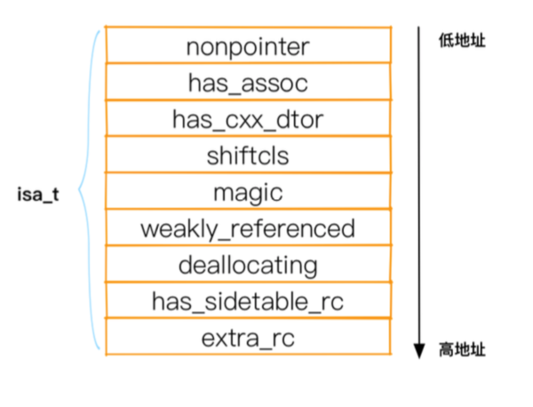
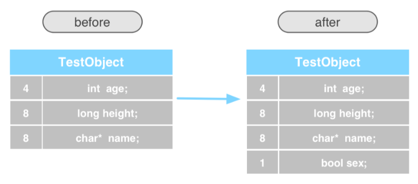
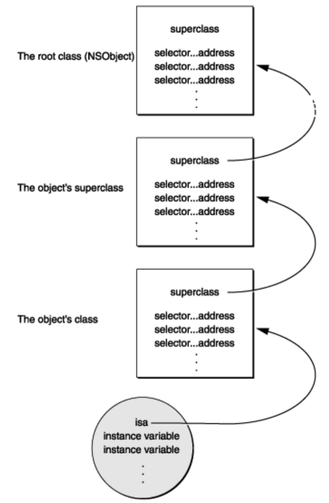
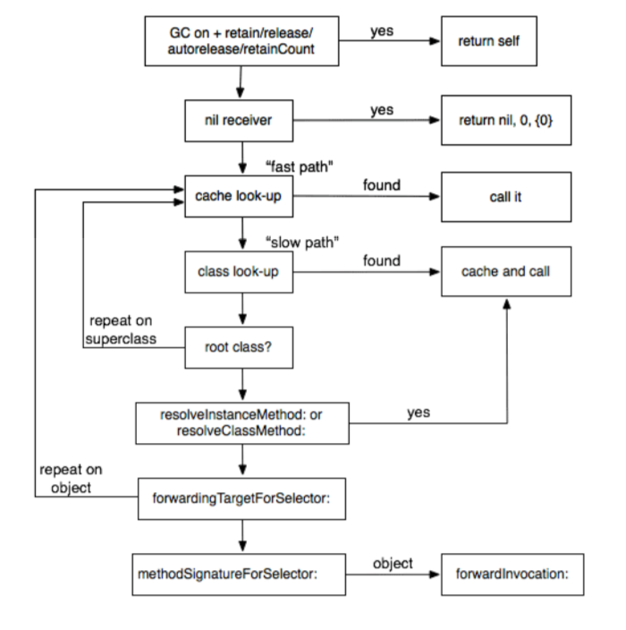
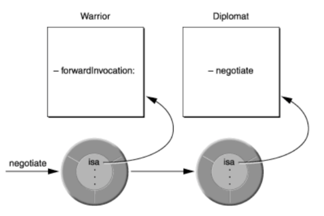

#	Runtime


## 1、Runtime 基础定义
#### 1.1、对象模型
&emsp; 每个对象都是一个 `objc_object`的结构体，结构体中有一个 `isa` 指针，指向自己所属的类，有 Runtime 负责创建对象。

&emsp; 类是 `objc_class`结构体，继承自 `objc_object `，所以类也是一个对象。类对象只会被创建一次，在 `objc_class` 结构体重定义了对象的 `method list`、`protocol`、`ivar list`等 表示对象的行为。


#### 1.2、IMP

&emsp; IMP 是一个函数指针。 `typedef void (*IMP)(void /*  */);`
	
&emsp; 通过以下函数获取 IMP

```C
// 实例对象/类对象 都可以调用
- (IMP)methodForSelector:(SEL)aSelector;
// 类对象调用
+ (IMP)instanceMethodForSelector:(SEL)aSelector;
```

将原始方法回调替换为 `Block` 的回调。

```C
IMP function1 = imp_implementationWithBlock(^(id self, NSString *text){
    NSLog(@"this is a test block ~");
}) ;
    
const char *types = sel_getName(@selector(testMethod:)) ;
class_replaceMethod([Persion class], @selector(testMethod:), function1, types) ;
    
```

#### 1.3、Method

```C
typedef struct method_t *Method;

struct method_t { 
	SEL name;				// 函数名
	const char *types; 		// 标记
	IMP imp; 				// 指针
};
```
#### 1.4、Property

属性是 `objc_property_t`类型，本质为 `property_t`结构体

```C
typedef struct property_t *objc_property_t;
struct property_t {
	const char *name; 
	const char *attributes;
};
```
通过以下方法获取对应的 `objc_property_t`属性结构体。

```C
// 实例对象属性列表
objc_property_t * class_copyPropertyList􏴓Class cls􏰏unsigned int * outCount􏴔 
// 协议属性列表
objc_property_t * protocol_copyPropertyList􏴓Protocol * proto􏰏unsigned int * outCou nt􏴔
```
通过以下方法获取对应 `objc_property_t`结构体

```C
objc_property_t class_getProperty􏴓Class cls􏰏const char * name􏴔
objc_property_t protocol_getProperty􏴓Protocol * proto􏰏const char * name􏰏BOOL isRe quiredProperty􏰏BOOL isInstanceProperty􏴔
```

#### 1.5、内存布局
创建实例对象时，会根据其对应的的 Class 分配内存，内存构成是 ivars+isa_t.
实例变量不止包含当前 Class 的 ivars 也包含其继承链中的 ivars。

Runtime 不能动态修改 ivars 会破坏已有的内存布局。

#### 1.6、方法传参
实例变量方法调用，通过 `obje_msgSend()` 发起，会传入 `self` 和 `SEL`

调用 `super`方法，则用 `objc_msgSendSuper`实现。

##	2、Runtime 结构体

#### 2.1、对象结构体
OC 中每个对象都是一个结构体 结构体中都包含一个 isa 的成员变量，位于成员变量第一位。

```C
struct objc_object{
private:
	isa_t isa;
}
```

```C
// isa 定义如下：

union isa_t {
      isa_t() { }
      isa_t(uintptr_t value) : bits(value) { }
      Class cls;
      uintptr_t bits;
# if __arm64__
#   define ISA_MASK        0x0000000ffffffff8ULL
#   define ISA_MAGIC_MASK  0x000003f000000001ULL
#   define ISA_MAGIC_VALUE 0x000001a000000001ULL
  
  struct {
	  uintptr_t nonpointer 				: 1;	// 32位还是64位
	  uintptr_t has_assoc				: 1;	// 对象是否含有或者曾经含有关联引用，没有则可以更快的是否对象
        uintptr_t has_cxx_dtor			: 1;	// 是否有 C++或者 OC 的析构函数
        uintptr_t shiftcls				: 33;	// 对象指向类的内存地址，也就是 isa 指向的地址
        uintptr_t magic					: 6;	// 对象是否初始化完成
        uintptr_t weakly_referenced		: 1;	// 对象是否弱引用或者曾经被弱引用
        uintptr_t deallocating			: 1;	// 对象是否正在被释放中
        uintptr_t has_sidetable_rc		: 1;	// 对象引用计数太大，释放超出存储区域 
        uintptr_t extra_rc				: 19;	// 对象的引用计数
#		define RC_ONE		(1ULL<<45)
#		define RC_HALF	(1ULL<<18)
  };
# elif	__x86_64__
// ...
# elif	__armv7__
// ...
# else
//...
};
  
```

arm64 架构下， isa_t 的布局为下，不同的架构布局方式有所不同，但是参数是一样的。



#### 2.2、类结构体

```C
struct objc_class : objc_object {
	// class isa
	Class superclass;			// 指向起父类的 objc_class
	cache_t cache;				// 处理已经调用方法的缓存
	// bits 内部定义了 uintptr 类型的 bits 成员变量，存储了 class_rw_t 的地址，定义了一些基本操作，如 获取 class_rw_t、raw isa状态，是否 swift等函数
	class_data_bits bits;	
	
	class_rw_t *data() {
		return bits.data();
	}	
	void setData(class_rw_t *nweData) {
		bit.setData(newData) ;
	}
	// ...
}

// 函数实现： 通过对 uintptr_t 类型的 bits 变量做位运算查找对用的值，获取 class_rw_t 指针
uintptr_t 本质上是􏲭􏴝􏲬􏰲􏰝􏳍 unsigned long 的􏰒 typedef，unsigned long 在􏰀64位处理器中占 􏴑􏳢􏴞􏰁􏳰8字节，正好是􏳲􏰂􏱈􏳴􏰲64位的二进制，通过􏴠􏰣􏱚􏰑 FAST_DATA_MASK 转换为二进制后是取出􏴡􏴢􏲊􏴟􏱷􏴠􏲹􏰂􏰲􏱲 bits 中的 􏰁􏰒47-3􏰒􏲶􏴣􏰂􏱈 􏳴􏰲􏱲位置，正好是 􏱳class_rw_t 􏳈􏴐􏰣指针

class_rw_t* data() {
return (class_rw_t *)(bits & FAST_DATA_MASK);
}

```


##	3、Runtime 源码分析

#### 3.1、对象的初始化
创建对象的地方有两种方式：

1、 calloc 开辟内存，initInstanceIsa 初始化这块内存。  
2、直接用 class_createInstance 由内部实现初始化逻辑。

#### 3.2、addMethod 方法实现
1、先判断需要添加的方法是否存在，存在则直接返回对应的 IMP，`class_addMethod`中有 replace 字段，表示是否替换原有方法，YES 则替换。  
2、需要添加的方法不存在，则创建一个 `method_list_t` 结构体指针，设置三个基本参数 name、types、imp，然后通过 `attachLists`函数将新创建的 `method_list_t` 结构体让添加到方法列表中。  

`attachLists`实现方法 是通过对原有地址做位移，将创建的 `method_list_t` copy 到方法列表中。

```C
static IMP 
addMethod(Class cls, SEL name, IMP imp, const char *types, bool replace)
{
    IMP result = nil;
    
    method_t *m;
    
    if ((m = getMethodNoSuper_nolock(cls, name))) {
        // already exists
        if (!replace) {		// 直接返回
            result = m->imp;
        } else {	 // 替换
            result = _method_setImplementation(cls, m, imp);
        }
    } else {		// 创建新的
        // fixme optimize
        method_list_t *newlist;
        newlist = (method_list_t *)calloc(sizeof(*newlist), 1);
        newlist->entsizeAndFlags = 
            (uint32_t)sizeof(method_t) | fixed_up_method_list;
        newlist->count = 1;
        newlist->first.name = name;
        newlist->first.types = strdupIfMutable(types);
        newlist->first.imp = imp;
        
        // 添加到列表
        prepareMethodLists(cls, &newlist, 1, NO, NO);
        cls->data()->methods.attachLists(&newlist, 1);
        flushCaches(cls);	// 缓存

        result = nil;
    }

    return result;
}
```

#### 3.3、添加 ivar
Runtime 可以通过 `class_addIvar` 向类添加实例对象。  
不能像一个已经存在的类添加示例变量，只能通过 `Runtime API`创建的类动态添加示例变量。  

函数应该在调用 `objc_allocateClassPair`函数创建类之后，以及调用 `objc_registerClassPair` 函数注册类之间添加实例变量。

```C
// add ivar
- (void)runtimeAddIvar {
    // create class ：getClass 判断类比是否存在， superclass 判断父类是否合适
    Class testClass = objc_allocateClassPair([NSObject class], "TestClass", 0) ;
    BOOL isAdd = class_addIvar(testClass, "password", sizeof(NSString *), log2(sizeof(NSString *)), @encode(NSString *)) ;
    objc_registerClassPair(testClass) ;
    if (isAdd) {
        id object = [[testClass alloc] init];
        [object setValue:@"123456" forKey:@"password"];
        NSLog(@"testClass `s password is %@", [object valueForKey:@"password"]);
    }
}

/** 以下方法实现 */
// 创建类
Class objc_allocateClassPair(Class superclass, const char *name,
                             size_t extraBytes) {
    Class cls, meta;
    // 判断类名是否已经存在，supperClass 是否合适
    if (getClass(name)  ||  !verifySuperclass(superclass, true/*rootOK*/)) {
        return nil;
    }
    // 创建元类和类 -- 分配内存空间
    cls  = alloc_class_for_subclass(superclass, extraBytes);
    meta = alloc_class_for_subclass(superclass, extraBytes);
    // 初始化操作
    objc_initializeClassPair_internal(superclass, name, cls, meta);
    return cls;
}
// 注册类
void objc_registerClassPair(Class cls) {
    
    // Clear "under construction" bit, set "done constructing" bit
    cls->ISA()->changeInfo(RW_CONSTRUCTED, RW_CONSTRUCTING | RW_REALIZING);
    cls->changeInfo(RW_CONSTRUCTED, RW_CONSTRUCTING | RW_REALIZING);

    // Add to named class table.
    addNamedClass(cls, cls->data()->ro->name);
}
static void addNamedClass(Class cls, const char *name, Class replacing = nil) {
    Class old;
    if ((old = getClass(name))  &&  old != replacing) {
    //  递归注册元类和类
        inform_duplicate(name, old, cls);
        addNonMetaClass(cls);
    } else {
    //  注册类实现方式
        NXMapInsert(gdb_objc_realized_classes, name, cls);
    }
}
```
**只能想运行时动态创建的类添加 ivar，不能像已存在的类添加 ivar**  
因为在编译时只读结构体 `class_ro_t`就会被确定，在运行时不可更改， `ro`结构体中有个字段是 `instanceSize`,便是当前类在创建对象是需要的空间大小，后面的创建都根据这个 size 分配内存。如果对一个已经存在的类增加一个参数，改变了 ivars 的结构，在方便改变之前创建的对象时会出现地址越界的问题。



#### 3.4、数据访问
对象类型用于标记当前对象所占空间大小，访问对象时根据指针找到对应内存区，根据指针类型取多少范围的内存，完成对象的读取。  

```C
int a = 20 ; --- int 代表四个字节的长度。
char b = "i";--- char 代表一个字节的长度。
```

#### 3.5、Protocol
协议是 `procotol_t` 结构体，继承自 `objc_object`，所以具备对象的特征。  
协议中可以声明对象方法、类方法，以及对象属性和类属性。

```C

struct protocol_t : objc_object {
    const char *mangledName;
    struct protocol_list_t *protocols;
    method_list_t *instanceMethods;
    method_list_t *classMethods;
    method_list_t *optionalInstanceMethods;
    method_list_t *optionalClassMethods;
    property_list_t *instanceProperties;
    uint32_t size;   // sizeof(protocol_t)
    uint32_t flags;
    // Fields below this point are not always present on disk.
    const char **_extendedMethodTypes;
    const char *_demangledName;
    property_list_t *_classProperties;
};
```
具备了对象的特征，也就是有 isa 指针的，在 procotol 中所有的 isa 都指向同一个类 `Procotol`  

协议的初始化：`	_read_images`函数中完成，具体为获取 `Procotol list`，然后遍历整个数组，调用 `readProcotol` 函数进行初始化操作。  

**Porcotol 是可以在运行时动态创建添加的，和创建 Class 过程相册，分为创建和注册两部分**

```C
// 创建新的Protocol，创建后还需要调用下面的register方法
Protocol *
objc_allocateProtocol(const char *name)
{
	// 协议已经存在，则创建失败
    if (getProtocol(name)) {
        return nil;
    }

    protocol_t *result = (protocol_t *)calloc(sizeof(protocol_t), 1);

    // 下面的cls是__IncompleteProtocol类，表示是未完成的Protocol
    extern objc_class OBJC_CLASS_$___IncompleteProtocol;
    Class cls = (Class)&OBJC_CLASS_$___IncompleteProtocol;
    result->initProtocolIsa(cls);
    result->size = sizeof(protocol_t);
    // fixme mangle the name if it looks swift-y?
    result->mangledName = strdupIfMutable(name);

    // fixme reserve name without installing

    return (Protocol *)result;
}

// 向protocol的哈希表中，注册新创建的Protocol对象
void objc_registerProtocol(Protocol *proto_gen) 
{
    protocol_t *proto = newprotocol(proto_gen);

    rwlock_writer_t lock(runtimeLock);

    extern objc_class OBJC_CLASS_$___IncompleteProtocol;
    Class oldcls = (Class)&OBJC_CLASS_$___IncompleteProtocol;
    extern objc_class OBJC_CLASS_$_Protocol;
    Class cls = (Class)&OBJC_CLASS_$_Protocol;

    // 如果已经被注册到哈希表中，则直接返回
    if (proto->ISA() == cls) {
        _objc_inform("objc_registerProtocol: protocol '%s' was already "
                     "registered!", proto->nameForLogging());
        return;
    }
    // 如果当前protocol的isa不是__IncompleteProtocol，表示这个protocol是有问题的，则返回
    if (proto->ISA() != oldcls) {
        _objc_inform("objc_registerProtocol: protocol '%s' was not allocated "
                     "with objc_allocateProtocol!", proto->nameForLogging());
        return;
    }

    // NOT initProtocolIsa(). The protocol object may already 
    // have been retained and we must preserve that count.
    proto->changeIsa(cls);

    NXMapKeyCopyingInsert(protocols(), proto->mangledName, proto);
}
```


#### 3.6、SEL
现在的 SEL 是一个 const char* 的常量字符串，代表一个名字  `typedef struct objc_selector *SEL`  
之前是 `objc_selector` 结构体   

在 Runtime 源码中，大部分 SEL 和 construction char * 都是强制转换的，二者是用一块内存。

```C
static SEL sel_alloc(const char *name, bool copy) {
	return (SEL)(copy ? strdupIfMutable(name) : name); 
}
```
#### 3.7、对等交换协议

```C
http://www.gnustep.org/
苹果的一套对等交换源码，将 OC 代码重新实现了一遍，内部实现大致和苹果的类似。
```


##	4、Runtime 加载过程

#### 4.1、程序中动态库优点
1、防止重复。iOS系统中所有 app 公用一套系统动态库，防止重复的内存占用。  
2、减少包的体积。动态库内置在iOS系统中，打包时不需要讲这部分打进去，减小体积。  
3、动态性。系统动态库动态加载，可以在更新系统之后将动态库换成洗的动态库。 

#### 4.2、加载过程
1、应用程序启动后，由`dyld`将应用程序假造到二进制中，并完成一些文件的初始化操作。  
2、Runtime 向`dyld`中注册回调函数。  
3、通过`ImageLoader`将所有`image`加载到内存中。  
4、`dyld`在`image`发生改变时，主动调用回调函数。  
5、Runtime 接收到`dyld`的函数回调，开始执行 `map_images`、`load_images`等操作，并回调 `+load`方法。  
6、调用 `main()`函数，开始执行业务代码。

#### 4.3、map images
`Runtime`加载时，会调用 `_objc_init` 函数，并在内部注册三个函数指针。`map_images`函数是初始化的关键，内部完成了大量 Runtime 环境的初始化操作。
`map_images`函数中，内部也是做了一个调用中转，然后调用到 `map_images_nolock`函数，内部核心就是 `_read_images`函数。

```C
// runtime加载入口
void _objc_init(void)
{
/* 各种资源的 init 
    static bool initialized = false;
    if (initialized) return;
    initialized = true;
    
    // fixme defer initialization until an objc-using image is found?
    environ_init();
    tls_init();
    static_init();
    lock_init();
    exception_init();
 */
    _dyld_objc_notify_register(&map_images, load_images, unmap_image);
}

// 加载所有image
void
map_images(unsigned count, const char * const paths[],
           const struct mach_header * const mhdrs[])
{
    rwlock_writer_t lock(runtimeLock);
    return map_images_nolock(count, paths, mhdrs);
}


void 
map_images_nolock(unsigned mhCount, const char * const mhPaths[],
                  const struct mach_header * const mhdrs[])
{
    if (hCount > 0) {
        _read_images(hList, hCount, totalClasses, unoptimizedTotalClasses);
    }
}
```

**`_read_images`函数内部逻辑**  
1、加载所有类到类的 `gdb_objc_realized_classes` 表中。  
2、对所有类做重映射。  
3、将所有 SEL 都注册到 `namedSelector`表中。  
4、修复函数指针遗留。  
5、将所有的 `Protocol` 都添加到 `protocol_map`表中。  
6、将所有 `Protocol`做重映射。  
7、初始化所有非懒加载的类，进行 `rw`、`ro`等操作。  
8、遍历已经标记的懒加载类，做初始化操作。  
9、处理所有 `Category` 包括 Class 和 Meta Class.  
10、初始化所有未初始化的类。

**精简版源码如下：**  

```C
void _read_images(header_info **hList, uint32_t hCount, int totalClasses, int unoptimizedTotalClasses)
{
    header_info *hi;
    uint32_t hIndex;
    size_t count;
    size_t i;
    Class *resolvedFutureClasses = nil;
    size_t resolvedFutureClassCount = 0;
    static bool doneOnce;
    TimeLogger ts(PrintImageTimes);

    runtimeLock.assertWriting();

#define EACH_HEADER \
    hIndex = 0;         \
    hIndex < hCount && (hi = hList[hIndex]); \
    hIndex++

    if (!doneOnce) {
        doneOnce = YES;
        // 0、实例化存储类的哈希表，并且根据当前类数量做动态扩容
        int namedClassesSize = 
            (isPreoptimized() ? unoptimizedTotalClasses : totalClasses) * 4 / 3;
        gdb_objc_realized_classes =
            NXCreateMapTable(NXStrValueMapPrototype, namedClassesSize);
    }

    // 1、由编译器读取类列表，并将所有类添加到类的哈希表中，并且标记懒加载的类并初始化内存空间
    for (EACH_HEADER) {
        if (! mustReadClasses(hi)) {
            // Image is sufficiently optimized that we need not call readClass()
            continue;
        }

        bool headerIsBundle = hi->isBundle();
        bool headerIsPreoptimized = hi->isPreoptimized();

        /** 将新类添加到哈希表中 */
        
        // 从编译后的类列表中取出所有类，获取到的是一个classref_t类型的指针
        classref_t *classlist = _getObjc2ClassList(hi, &count);
        for (i = 0; i < count; i++) {
            // 数组中会取出OS_dispatch_queue_concurrent、OS_xpc_object、NSRunloop等系统类，例如CF、Fundation、libdispatch中的类。以及自己创建的类
            Class cls = (Class)classlist[i];
            // 通过readClass函数获取处理后的新类，内部主要操作ro和rw结构体
            Class newCls = readClass(cls, headerIsBundle, headerIsPreoptimized);

            // 初始化所有懒加载的类需要的内存空间
            if (newCls != cls  &&  newCls) {
                // 将懒加载的类添加到数组中
                resolvedFutureClasses = (Class *)
                    realloc(resolvedFutureClasses, 
                            (resolvedFutureClassCount+1) * sizeof(Class));
                resolvedFutureClasses[resolvedFutureClassCount++] = newCls;
            }
        }
    }
    
    // 2、将未映射Class和Super Class重映射，被remap的类都是非懒加载的类
    if (!noClassesRemapped()) {
        for (EACH_HEADER) {
            // 重映射Class，注意是从_getObjc2ClassRefs函数中取出类的引用
            Class *classrefs = _getObjc2ClassRefs(hi, &count);
            for (i = 0; i < count; i++) {
                remapClassRef(&classrefs[i]);
            }
            // 重映射父类
            classrefs = _getObjc2SuperRefs(hi, &count);
            for (i = 0; i < count; i++) {
                remapClassRef(&classrefs[i]);
            }
        }
    }
    // 3、将所有SEL都注册到哈希表中，是另外一张哈希表
    static size_t UnfixedSelectors;
    sel_lock();
    for (EACH_HEADER) {
        if (hi->isPreoptimized()) continue;

        bool isBundle = hi->isBundle();
        // 取出的是字符串数组，例如首地址是"class"
        SEL *sels = _getObjc2SelectorRefs(hi, &count);
        UnfixedSelectors += count;
        for (i = 0; i < count; i++) {
            // sel_cname函数内部就是将SEL强转为常量字符串
            const char *name = sel_cname(sels[i]);
            // 注册SEL的操作
            sels[i] = sel_registerNameNoLock(name, isBundle);
        }
    }
    sel_unlock();
    
    // 4、修复旧的函数指针调用遗留
    for (EACH_HEADER) {
        message_ref_t *refs = _getObjc2MessageRefs(hi, &count);
        if (count == 0) continue;
        for (i = 0; i < count; i++) {
            // 内部将常用的alloc、objc_msgSend等函数指针进行注册，并fix为新的函数指针
            fixupMessageRef(refs+i);
        }
    }

    // 5、遍历所有协议列表，并且将协议列表加载到Protocol的哈希表中
    for (EACH_HEADER) {
        extern objc_class OBJC_CLASS_$_Protocol;
        // cls = Protocol类，所有协议和对象的结构体都类似，isa都对应Protocol类
        Class cls = (Class)&OBJC_CLASS_$_Protocol;
        assert(cls);
        // 获取protocol哈希表
        NXMapTable *protocol_map = protocols();
        bool isPreoptimized = hi->isPreoptimized();
        bool isBundle = hi->isBundle();

        // 从编译器中读取并初始化Protocol
        protocol_t **protolist = _getObjc2ProtocolList(hi, &count);
        for (i = 0; i < count; i++) {
            readProtocol(protolist[i], cls, protocol_map, 
                         isPreoptimized, isBundle);
        }
    }
    
    // 6、修复协议列表引用，优化后的images可能是正确的，但是并不确定
    for (EACH_HEADER) {
        // 需要注意到是，下面的函数是_getObjc2ProtocolRefs，和上面的_getObjc2ProtocolList不一样
        protocol_t **protolist = _getObjc2ProtocolRefs(hi, &count);
        for (i = 0; i < count; i++) {
            remapProtocolRef(&protolist[i]);
        }
    }
    
    // 7、实现非懒加载的类，对于load方法和静态实例变量
    for (EACH_HEADER) {
        classref_t *classlist = 
            _getObjc2NonlazyClassList(hi, &count);
        for (i = 0; i < count; i++) {
            Class cls = remapClass(classlist[i]);
            if (!cls) continue;

            // 实现所有非懒加载的类(实例化类对象的一些信息，例如rw)
            realizeClass(cls);
        }
    }
    
    // 8、遍历resolvedFutureClasses数组，实现所有懒加载的类
    if (resolvedFutureClasses) {
        for (i = 0; i < resolvedFutureClassCount; i++) {
            // 实现懒加载的类
            realizeClass(resolvedFutureClasses[i]);
            resolvedFutureClasses[i]->setInstancesRequireRawIsa(false/*inherited*/);
        }
        free(resolvedFutureClasses);
    }    

    // 9、发现和处理所有Category
    for (EACH_HEADER) {
        // 外部循环遍历找到当前类，查找类对应的Category数组
        category_t **catlist = 
            _getObjc2CategoryList(hi, &count);
        bool hasClassProperties = hi->info()->hasCategoryClassProperties();

        // 内部循环遍历当前类的所有Category
        for (i = 0; i < count; i++) {
            category_t *cat = catlist[i];
            Class cls = remapClass(cat->cls);
            
            // 首先，通过其所属的类注册Category。如果这个类已经被实现，则重新构造类的方法列表。
            bool classExists = NO;
            if (cat->instanceMethods ||  cat->protocols  
                ||  cat->instanceProperties) 
            {
                // 将Category添加到对应Class的value中，value是Class对应的所有category数组
                addUnattachedCategoryForClass(cat, cls, hi);
                // 将Category的method、protocol、property添加到Class
                if (cls->isRealized()) {
                    remethodizeClass(cls);
                    classExists = YES;
                }
            }

            // 这块和上面逻辑一样，区别在于这块是对Meta Class做操作，而上面则是对Class做操作
            // 根据下面的逻辑，从代码的角度来说，是可以对原类添加Category的
            if (cat->classMethods  ||  cat->protocols  
                ||  (hasClassProperties && cat->_classProperties)) 
            {
                addUnattachedCategoryForClass(cat, cls->ISA(), hi);
                if (cls->ISA()->isRealized()) {
                    remethodizeClass(cls->ISA());
                }
            }
        }
    }
    
    // 10、初始化从磁盘中加载的所有类，发现Category必须是最后执行的
    // 从runtime objc4-532版本源码来看，DebugNonFragileIvars字段一直是-1，所以不会进入这个方法中
    if (DebugNonFragileIvars) {
        realizeAllClasses();
    }
#undef EACH_HEADER
}
```

#### 4.4、load images

1、load 方法调用实际比 main 函数要靠前。  
2、load 由系统调用，整个运行期间只调用一次。  
3、 `Method Swizzling`都会放在 load 方法中执行，可以在 main 函数之前对类方法进行交换。  
4、对类添加 Category 并且重写原有方法之后，会覆盖原类的方法。但是 load 方法不会，原类和 Category 的 load 方法都会执行


#### 4.5、load 源码分析
`load_images` 主要做两件事：  
1、通过 `prepare_load_method` 函数准备 `Class load list` 和 `Category load list`。  
2、通过 `call_load_method` 函数调用已经准备好的两个方法列表。  
**load 执行顺序： 父类-->子类-->分类**

```C
void
load_images(const char *path __unused, const struct mach_header *mh)
{
    // Return without taking locks if there are no +load methods here.
    if (!hasLoadMethods((const headerType *)mh)) return;
    
    // 准备Class list和Category list
    prepare_load_methods((const headerType *)mh);
        
    // 调用已经准备好的Class list和Category list
    call_load_methods();
}
```

**`prepare_load_methods`函数实现**

```C
// 准备Class list 和 Category list
void prepare_load_methods(const headerType *mhdr)
{
    size_t count, i;

    // 获取到非懒加载的类的列表
    classref_t *classlist = 
        _getObjc2NonlazyClassList(mhdr, &count);
    for (i = 0; i < count; i++) {
        // 设置Class的调用列表
        schedule_class_load(remapClass(classlist[i]));
    }
    
    // 获取到非懒加载的Category列表
    category_t **categorylist = _getObjc2NonlazyCategoryList(mhdr, &count);
    for (i = 0; i < count; i++) {
        category_t *cat = categorylist[i];
        Class cls = remapClass(cat->cls);
        // 忽略弱链接的类别
        if (!cls) continue;  // category for ignored weak-linked class
        // 实例化所属的类
        realizeClass(cls);
        assert(cls->ISA()->isRealized());
        // 设置Category的调用列表
        add_category_to_loadable_list(cat);
    }
}

static void schedule_class_load(Class cls)
{
    if (!cls) return;
    // 已经添加Class的load方法到调用列表中
    if (cls->data()->flags & RW_LOADED) return;

    // 确保super已经被添加到load列表中，默认是整个继承者链的顺序
    schedule_class_load(cls->superclass);
    
    // 将IMP和Class添加到调用列表
    add_class_to_loadable_list(cls);
    // 设置Class的flags，表示已经添加Class到调用列表中
    cls->setInfo(RW_LOADED); 
}

void add_category_to_loadable_list(Category cat)
{
    IMP method;
    
    // 获取Category的load方法的IMP
    method = _category_getLoadMethod(cat);

    // 如果Category没有load方法则return
    if (!method) return;
    
    // 如果已经使用的大小等于数组大侠，对数组进行动态扩容。
    if (loadable_categories_used == loadable_categories_allocated) {
        loadable_categories_allocated = loadable_categories_allocated*2 + 16;
        loadable_categories = (struct loadable_category *)
            realloc(loadable_categories,
                              loadable_categories_allocated *
                              sizeof(struct loadable_category));
    }

    loadable_categories[loadable_categories_used].cat = cat;
    loadable_categories[loadable_categories_used].method = method;
    loadable_categories_used++;
}

```

**`call_load_methods`函数实现**

```C
void call_load_methods(void)
{
    bool more_categories;
    void *pool = objc_autoreleasePoolPush();

    do {	// 反复循环执行 call_class_loads 函数，直到数组中每天接执行的 load 方法。
        // 1. Repeatedly call class +loads until there aren't any more
        while (loadable_classes_used > 0) {
            call_class_loads();
        }

        // 2. Call category +loads ONCE
        more_categories = call_category_loads();

        // 3. Run more +loads if there are classes OR more untried categories
    } while (loadable_classes_used > 0  ||  more_categories);

    objc_autoreleasePoolPop(pool);
}

```

#### 4.6、initialize

`initialize` 方法也是由 Runtime 调用，自己不可以直接调用。  
`initialize` 方法在第一次调用类所属方法的时候才会调用。 所以理论上，只要类的方法不会调用，initialize 永远不会执行。  
`Category` 中的 initialize 方法会覆盖原方法。

#### 4.7、initialize 源码分析

1、在像对象发送消息时，`lookUpImpOrForward` 函数会判断当期A类是否被初始化，如果没有，则先进行初始化在调用类方法。  
2、在进行初始化的时候，会先初始化父类。  
3、关键代码 `_class_initialize` 方法源码。  

```C
// 第一次调用类的方法，初始化类对象
void _class_initialize(Class cls)
{
    Class supercls;
    bool reallyInitialize = NO;

    // 递归初始化父类。initizlize不用显式的调用super，因为runtime已经在内部调用了
    supercls = cls->superclass;
    if (supercls  &&  !supercls->isInitialized()) {
        _class_initialize(supercls);
    }
    // Try to atomically set CLS_INITIALIZING.
    {
        monitor_locker_t lock(classInitLock);
        if (!cls->isInitialized() && !cls->isInitializing()) {
            cls->setInitializing();
            reallyInitialize = YES;
        }
    }
    
    if (reallyInitialize) {
        
        _setThisThreadIsInitializingClass(cls);

        if (MultithreadedForkChild) {
            performForkChildInitialize(cls, supercls);
            return;
        }

        @try {
        	// 通过objc_msgSend()函数调用initialize方法
           callInitialize(cls);
        }
        @catch (...) {
            @throw;
        }
        @finally
        {
            // Done initializing.
            // 执行initialize方法后，进行系统的initialize过程
            lockAndFinishInitializing(cls, supercls);
        }
        return;
    }
    
    else if (cls->isInitializing()) {
        if (_thisThreadIsInitializingClass(cls)) {
            return;
        } else if (!MultithreadedForkChild) {
            waitForInitializeToComplete(cls);
            return;
        } else {
            _setThisThreadIsInitializingClass(cls);
            performForkChildInitialize(cls, supercls);
        }
    }
}
```

**lockAndFinishInitializing 函数中会完成一些初始化操作，内部调用 _finishInitializing 函数，在函数内部调用 setInitialized 函数，核心工作都由 setInitialized 执行。**

setInitialized 函数负责初始化嘞和元类，函数内部主要是查找当前类和元类中是否定义了某些方法，然后根据查找结果设置类和元类的一些标志位。


#5、消息发送机制

##5.1、方法调用

Runtime 进行方法调用的本质上是发送消息，`objc_msgSend()`实现。

```C
	[object testMethod];
	
	objc_msgSend(object, @selector(testMethod)) ;
```

**不同的类中相同的 SEL 是同一个对象。**
Runtime 维护了一个 SEL 表，存储 SEL 不按照类类存储，只要相同的 SEL 就会被看着一个，并存储到表中。  
项目加载时，会将所有方法都加载到这个表中，动态生成的方法也会被加载到表中。

##5.2、隐藏函数

**Q:方法内部可以通过 self 来获取当前对象，但是 self 是从哪里来的？**

A:方法实现的本质是 C函数，C函数有两个默认参数 `self` `_cmd`，这两个默认参数在 Runtime 中并没有声明，在是在编译时自动生成的。相应对象是 self，调用方法是 _cmd  

```C
- (void)method {
	id target = getTheReceiver();
	SEL method = getTheMethod();
	
	if ( target == self || method == _cmd ) return nil;
	
	return [target performSelector:method]; 
}
```
##5.3、函数调用

对象被创建之后，自身类以及父类，知道 `NSObject` 类的部分，都会包含在对象的内存中。

**当前对象无论调用任何方法，receiver 都是 self 当前对象自身。**

## 5.4、消息发送流程

当对象被创建时，系统为其分配内存，并完成初始化工作。对象第一个变量是指向其类对象的指针 `isa` , `isa`指针可以访问其类对象，并通过类对象用于访问其所有继承者链中的类。



1、当对象接收到一条消息，消息函数会随着对象 `isa`指针到类的结构体中，在 `method list` 找方法对应的 `selector`。本类中找不到， `objc_msgSend`就到父类的方法列表中找，一直找到 `NSObject`中。

2、Runtime 在查找 `selector`过程中的优化：类的结构体中有 `cache` 字段，每个类有自己独立的 `cache`，在一个 `selector`呗调用后就会加到 `cache` 中，之后每次搜索都 会先在 `cache`中找，然后再在方法列表中找。

3、调用 OC 方法都会走消息发送。不要消息发送的过程可以获取方法的函数指着直接调用，

​	获取函数指针之后进行类型转换，转化为和调用函数相符的指针，发起调用即可。
​	
​	
## 5.5、cache_t
  当给一个对象发送消息时， RunTime 会沿着 isa 找到对应的类对象，单并不会查找 `method_list`，而是先查找 `cache_list`，如果有缓存则优先查找缓存，没有缓存再查找方法列表。

  
## 5.6、总结

1、判断当前 SEL 是否需要忽略，需要则返回一个 `_objc_ignored_method` 的 IMP 用来标记。  
2、判断接收消息的对象是否是 nil, OC 中对 nil 发送消息是无效的，调用时通过判断条件就过滤掉了。  
3、从方法缓存列中查找，通过 `cache_getImp` 函数进行查找，找到则直接返回 IMP。  
4、查找当前类的方法列表，查找是否有对应的 SEL，如果有则获取 `Method`对象，并从对象中获取 IMP，并返回。  
5、当前类中没有找到 SEL，则去父类中查找。先查找 `cache list`，在查找 `method list`，并沿着继承者链向上直到根类为止。  
6、如果类的继承者链中始终没有查找到 SEL，则进入动态方法解析。可以在 `resolveInstanceMethod`和`resolveClassMethod` 两个方法中动态添加实现。  
7、动态消息解析如果没有做出响应，则金融业动态消息转发阶段。需要在动态消息转发阶段做出处理，否则 crash 。


#6、Category

##6.1、 Category 
OC 中可以一个 Category 添加属性、方法、协议。

#####Category 和 Extension 区别：Extension 在编译器就直接和原类编译在一起，Category 在运行时动态添加到原类中


1、`_read_images`函数会执行一个循环嵌套，外部循环遍历所有类，取出当前类对应的 Category 数组，内部循环遍历 Catrgory 数组，取出每个 category_t 对象，然后执行 `addUnattachedCategoryForClass`函数添加到 Category 哈希表中。  

2、Category 维护了一个名叫 category_map 的哈希表，存储所有的 category_t 对象。  

3、调用 `remethodizeClass` 函数，向对应的 Class 中添加 Category 信息。  

在 `remethodizeClass`函数中会查找传入的 Class 参数对应的 Category 数组，然后将数组传给 attachCatefories 函数 执行操作。  
在 `attachCatefories`函数中 查找到 Category 的方法列表，属性列表，协议了；列表，然后通过对应的 attachLists 函数，添加到 Class 对应的 class_rw_t 结构体中。


##6.2、 方法覆盖

1、方法覆盖的原因  
多个 Category 和原类的方法重复定义的时候，原类和所有的 Category 都会存在，在进行调用的时候，会优先遍历 Category 的方法，并且后添加到项目中的方法会优先调用。在方法列表中找到此方法之后就不会继续向后查找，故类方法被 Category 覆盖。

2、如何在一个 Category 方法调用之后，调用所有的 Category 和原类方法？  
可以在一个 Category 方法被调用之后，遍历方法列表并调用其他同名方法。但是在遍历过程中不能调用自己的方法，否则会产生递归。可以在调用钱判断被调用的方法 IMP 是否是当前方法的 IMP。

3、如何在一个 Category 方法调用之后，只调用原类的方法？  
根据 2 的方法调用分析，Runtime 会优先调用 Category 方法，所以可以倒叙遍历方法列表，第一个即为原类的方法。


##6.3、 Category Associate

Category 中添加属性默认是没有实现方法的，如果调用属性则会崩溃。  

所有的通过 `associated` 添加的属性，都存在一个单独的哈希表中(AssociationHashMap) ，get 和 set 本质都是操作这个哈希表，通过对哈希表的映射来存取对象。


#7、消息转发

一个对象的方法被调用时，首先在对象所属的类中查找方法列表，如果当前类中没有则想父类中查找，一直找到根类 NSObject。如果始终没有找到方法实现，则进入消息转发步骤。



##7.1、动态消息解析

消息转发之前会进行一次 Runtime 动态添加方法的实现。  
通过重写 `resolveInstanceMethod:` 和 `resolveClassMethod:`动态添加示例方法和类方法。  
通过 `class_addMethod` 方法可以动态添加方法，添加方法时需要关联对应的函数指针，函数指针需要声明两个隐藏参数 self _cmd

##7.2、Message Forwarding

消息转发之前可以通过 `forwardingTargetForSelector:` 将未实现的方法转发给其他对象。  

消息转发时首先调用 `methodSignatureForSelector:` 方法，在内部生成 `NSMethodSignature` 类型的方法签名。生成签名对象时，可以指定 target 和 SEL，将两个参数换成其他参数，将消息转发给其他对象。  

`[otherObject methodSignatureForSelector: otherSelector];`
  
  生成 NSMethodSignature 签名对象只会，就会调用 `forwardInvocation:` 方法，如果还没有对消息进行处理，就会崩溃。
  
  
##7.3、消息转发

发送一条对象不能处理的消息，崩溃之前，系统会调用响应者的 `forwardInvocation:`方法，传入一个 NSInvocation 对象，包含原始消息和参数，只有在方法未实现的时候调用。可以实现 `forwardInvocation:`方法，将消息转发给另一个对象。  
`forwardInvocation:`方法是动态方法，重写这个方法实现消息转发。  
`forwardInvocation:`方法需要做的是 确认消息发送到哪里。可以处理多个需要转发的方法。


##7.4、转发和多继承



分属两个继承分支的类，可以通过消息转发机制实现多继承关系。  

通过消息转发实现的多继承相对于普通继承更有优势，可以将消息转发给多个对象，故可以按不同职责封装为不同对象，并转发给不同对象来处理。  
但是 `respondsToSelector:` 和 `isKindOfClass:` 方法判断的话依旧是 NO。


##7.5、使用技巧

###7.5.1、消息转发使用技巧

消息转发解决 调用未实现方法而导致崩溃的问题。

给 NSObject 类增加 Category，重写 `resolveInstanceMethod` 方法，动态创建未实现的方法，并将 IMP 统一设置为 `dynamicResolveMethod` 函数进行处理。这样未实现的方法都会执行 `dynamicResolveMethod` 函数，而不会崩溃，在函数中还可以做崩溃统计等操作。

```C
void dynamicResolveMethod(id self, SEL _cmd){
    NSLog(@"-------- 方法未实现~");
}

#pragma clang diagnostic push
#pragma clang diagnostic ignored "-Wobjc-protocol-method-implementation"

+(BOOL)resolveInstanceMethod:(SEL)sel {
    
    const char *types = sel_getName(sel) ;
    NSLog(@"--- method name: %s", types);
    class_addMethod([self class], sel, (IMP)dynamicResolveMethod, types) ;
    return YES ;
}

#pragma clang diagnostic pop

```

###7.5.2、多继承使用技巧


通过消息转发模拟多继承，在子类中实例化多个父类，当消息发送过来的时候，在消息转发的方法中，将调用重定向到父类的示例对象中，以实现多继承的效果。

子类通过遵守父类协议，来表示自己继承自哪些类，并在内部实例化对应的父类对象。在外接调用协议方法时，子类其实是没有实现父类的方法的，所以通过转发方法将消息转发给响应的父类。


#8、Method Swizzling

`Method Swizzling` 本质就是将 `IMP` 和 `SEL` 交换。  

##8.1、原理

`Method Swizzling`发生在运行时，主要是在运行时将两个方法进行交换。  
每个类都有存在一个 Dispatch Table ，作用是将 SEL 和 IMP 对应。`Method Swizzling`就是对这个 table 进行操作，让 SEL 对应另一个 IMP。

##8.2、Method Swizzling 类簇

对 类簇进行 `Method Swizzling`是没有作用的，需要对类进行。

```C
	获取真正的类
	objc_getClass("__NSArrayI") ;
```

##8.3、JRSwizzle 封装 MS 的第三方

#9、应用

##9.1、__attribute__

编译器指令，语法：__attribute__((0, 1, 2, ...))


**`objc_subclassing_restricted`** 表示当前类不能被继承

```C
__attribute__((objc_subclassing_restricted))
```


**`objc_requires_super`** 子类必须调用被修饰符修饰的方法的 super 方法。

```C

// testMethod 方法必须调用 [super testMethod];
- (void)testMethod __attribute__((objc_requires_super)); 
```

**`constructor / destructor`** 在 Main 函数执行 之前/之后 可以执行函数


**`overloadable`** 允许定义多个同名单不同参数类型的函数，在调用时编译器会根据传入参数类型自动匹配函数。

```C
__attribute__((overloadable)) void testMethod(int age) {}
__attribute__((overloadable)) void testMethod(NSString *name) {} 
__attribute__((overloadable)) void testMethod(BOOL gender) {}

```

**`objc_runtime_name `** 在编译时，将 Class / Protocol 指定为另外一个名字吗，且新名字不受命名规范约束，可以以数字开头。  
**可以做代码混淆**  

```C
__attribute__((objc_runtime_name("TestObject"))) 
@interface Object : NSObject
@end

// Testclass
NSStringFormClass([TestObject class]);
```

**cleanup** 指定一个函数给某个变量，在变量释放之前会执行此函数  

```C
	Object *obj __attribute__((cleanup(aaaaaaa))) = [Object new];
	
	变量释放之前会执行
	static void aaaaaaa(NSObject **obj) {
		NSLog(@"--- %@", *obj);
	}
```

**unused** 变量未使用时 不会报警告

```C
	NSObject *aa __attribute__((unused)) = [NSObject new];
```
